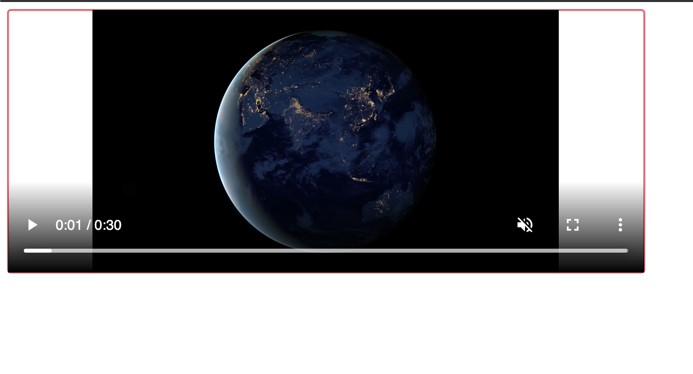

## Streaming a video through Apache Kafka.

If you dont have apache kafka installed you can follow this guide https://kafka.apache.org/quickstart .

Assuming you have zookeeper server and the kafka running.

There is a video in the root folder that you can use as an example.

Otherwise in a production env you could take the video from an S3 bucket for example.

Now to stream the video we have to make the producer to send them in chunks.

### Note.

    Kafka server by default has a limit of you much data you can send.

So originaly we call : http://127.0.0.1:5000/produce

### Then if we visit:

    http://127.0.0.1:5000/

    We should see our video playing.

